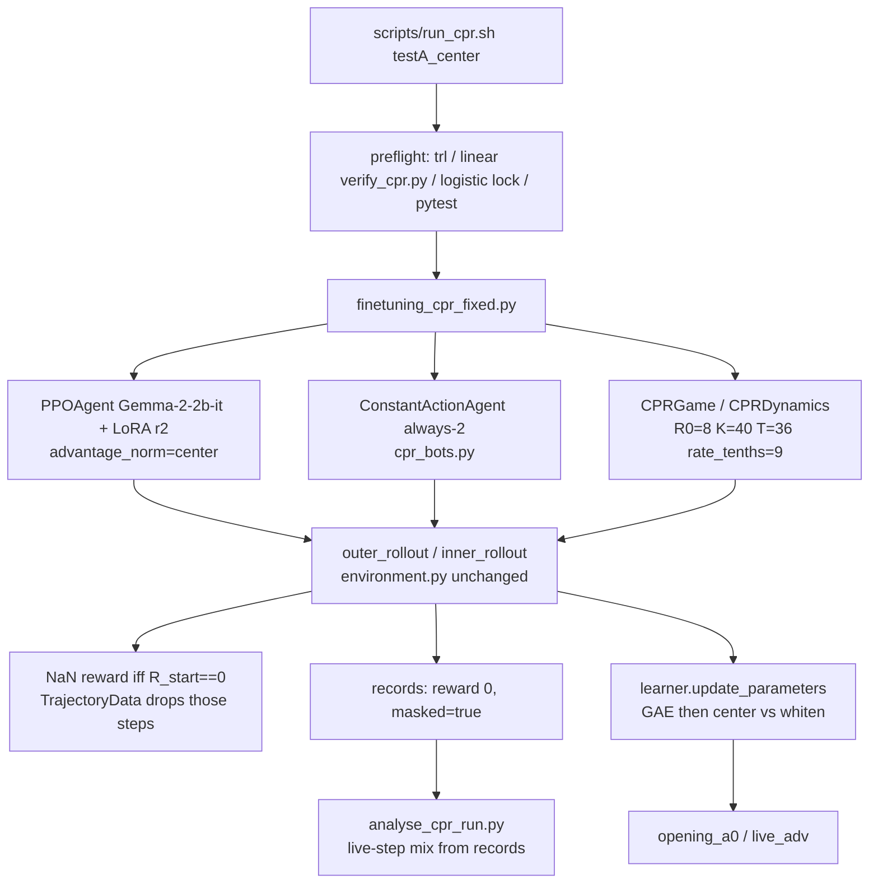

# Architecture — live CPR path

**Dated 1 September 2026.** Source of numbers: [`LIVE_FACTS.md`](LIVE_FACTS.md).
Live env is **logistic integer regen, R0=8, K=40, T=36, rate_tenths=9.** Not linear R0=20.
Walkthrough is `./scripts/run_cpr.sh testA_center`. Two-learner naive–naive is the same
spine with a second `PPOAgent` instead of `ConstantActionAgent`.

`verify_cpr.py` is the **linear fixture** (`R0=20, g=2, T=30`). The launcher runs it as a
preflight, then refuses to train unless the JSON is the locked logistic point.

---

## Config → metrics (testA_center)

```
./scripts/run_cpr.sh testA_center
        │  CONFIG  configs/cpr_testA_center.json
        │  ENTRY   finetuning_cpr_fixed.py
        │  OUT     checkpoints/cpr_log_testA_center
        │  seeds=1 epochs=15
        │
        ├─ preflight
        │     trl==0.11.4
        │     verify_cpr.py          ← linear fixture only
        │     config logistic lock   ← (8, 40, 36, 9)
        │     pytest tests/
        │     adapter/cpr_learner_r2 (init_lora_adapters.py if missing)
        │
        ▼
finetuning_cpr_fixed.py
        │  PPOAgent(advantage_norm="center")     agents.py
        │  ConstantActionAgent(action=2)         cpr_bots.py  (no Gemma)
        │  CPRGame(logistic)                     cpr_game.py
        │     CPRDynamics                        cpr_env.py  LOGISTIC
        │     CPRObservationManager ×2           cpr_observation_managers.py
        │
        ▼  once per epoch
environment.outer_rollout  (unmodified; type hints still say IteratedMatrixGame / PPOAgent)
        │  e_max=5 episodes
        │     inner_rollout  t_max=36 steps
        │        tokenize_observation → take_action
        │        CPRGame.step → TokenToActionMapper → CPRDynamics.step
        │        TrajectoryData._update  (drops NaN rewards)
        │     if not is_shaper: update_parameters + _reset
        │        learner: CustomPPOTrainer.step  (GAE → advantage_norm)
        │        partner: no-op, updates += 1
        │
        ▼  after last epoch
exp1_cpr_records          true rewards, masked flag, requests  (never NaN)
exp1_opening_a0           neural A0 on first live step of each game
exp1_live_adv             raw/post GAE on every live step
exp1_model1_training_metrics.txt
        │
        ▼
scripts/analyse_cpr_run.py   live-step mix + survival from records
                             (does not read opening_a0; openings are the Test A photograph)
```



Per epoch: 5 episodes × 3 parallel games × 36 steps. Only the learner is trained.
`fixed_partner_action` in the JSON is 2 (Test A) or 1 (Test B).

---

## Duck-typing into `outer_rollout`

`outer_rollout` never constructs `IteratedMatrixGame`. It reads `t_max`, `e_max`,
`n_games`, `obs_managers["agent_k"].game_description` / `instruction_prompt`, and calls
`game.step` plus `agent.tokenize_observation` / `take_action` / `update_parameters` /
`update_vf_coef` when `not agent.is_shaper`. `CPRGame` exposes that surface; reset
observations are one shared `game_description + instruction_prompt` because every reset
starts at R0. `ConstantActionAgent` (`cpr_bots.py`) is the same duck-type with dummy
token ids, a constant harvest token, `is_shaper=False`, and no-op updates so the partner
is never trained.

---

## NaN mask vs records zeros

A step is masked for PPO iff `R_start == 0` (already-dead pool). The collapse step itself
is a real decision and is not masked. `CPRGame._rewards` writes `nan` into those tensors
so `TrajectoryData._update` drops query, response, env id, and reward from the batch;
GAE never sees them. `game.records` stores the true integer reward `0` and a `masked`
flag. Mixing the two would NaN every headline metric.

---

## How action tokens reach Gemma

Configs list Gemma-2-2b-it digit ids `0–3 = [235276, 235274, 235284, 235304]`. The
observation ends with a turn tag and “Reply with only one number”; `PPOAgent.take_action`
generates `max_new_tokens=1` through `AllowedTokensLogitsProcessor`, which floors every
other logit. `TokenToActionMapper.map` turns the emitted id into `{0,1,2,3}` for
`CPRDynamics`. The bot skips the model and returns `self.token` (always 2 on Test A).

Untrained prior is ~90% on **2**; entropy **0.05**. Do not flatten the prior.

---

## `advantage_norm`: center vs whiten

After GAE, `CustomPPOTrainer.compute_advantages` calls `normalize_advantages`. **whiten**
(default, Test A always-2) is TRL `masked_whiten`: mean 0, variance 1 over the live batch.
**center** (`cpr_testA_center.json`) subtracts the masked mean and does not divide by std.
**none** passes raw GAE. Masked positions are zeroed in every mode.

On whitened Test A the critic starred opening 1 (raw A0 **+39.8** vs **+6.2** on 2);
batch whitening crushed that to **+1.38 vs +0.75**. Center Test A: Open-1 A0 **+16.7**
(raw still ~+40), Open-2 A0 **−5.7**. Later 2s still have large raw A (smear); after
centering they sit near 0, openings of 1 do not. `use_score_scaling` is off.

---

## Openings ≠ live-step mix (Test A)

Read `opening_a0`, not live-step mix. After a first 1, R=8→9 and (2,2) is a fixed point,
so a surviving policy is mostly 2s on the tape even when every game opened 1.
`analyse_cpr_run.py` gate 3 counts unmasked `request_1` over the whole horizon.

| | Whitened Test A | Center Test A |
|---|---|---|
| Take-1 live-step, epoch 15 | 3% | 9% |
| Open-1 share, epoch 1 → 15 | ~27% floor, falling | **27% → 87%** (100% at epoch 12) |
| Survival | 28/225 | epoch 1: 2/15; epoch 12: **15/15**; epoch 15: 13/15 |

Whitened policy still peaked on 2 (take-1 **6% → 3%**). Center already raised P(open 1)
against a frozen hawk; that does **not** mean shaping works. No shaper-vs-naive grid has
been run on this env.

Test B (frozen always-1): **219/225** lived. Opening 1 and 2 got the same star. Mix
**80% → 38% on 2, 18% → 62% on 3**. Greed, not copy-1.

---

## Ownership notes (viva, no notes)

1. **Env lock.** Live training is logistic integer regen **R0=8, K=40, T=36, rate_tenths=9**. Chicken, not PD. `verify_cpr.py` is the linear fixture (`R0=20, g=+2, T=30`); linear against an opponent playing `g` pins payoffs near `R0` — that is a written finding, not a live config.
2. **Chicken payoffs (constant pairs).** (1,1) → 36, lives. (2,2) → 7, dies ~round 4. (2,1) hawk vs dove → 72, lives. (3,3) collapses.
3. **Prior on 2.** Gemma-2-2b-it, action tokens `0–3 = [235276, 235274, 235284, 235304]`. Untrained ~90% on 2, entropy 0.05. Do not flatten the prior, do not `use_score_scaling`, do not add a take-1 bonus.
4. **Whitening vs center.** Whitening crushed opening-1’s star (+39.8 raw → +1.38). Center keeps scale (Open-1 A0 +16.7, Open-2 −5.7). Same seed family; folder `checkpoints/cpr_log_testA_center`.
5. **Test B greed.** Frozen always-1: 219/225 lived. Mix moved **off** 2 onto 3 (80%→38% on 2, 18%→62% on 3). Not copy-1. No 64-vs-7 basin vs a dove.
6. **Openings vs tape.** After open-1, R=8→9 and (2,2) is a fixed point, so live-step mix stays mostly 2s. Photograph is `opening_a0`, not `analyse_cpr_run` live mix.
7. **Stochastic aim.** Noise on this locked logistic update, not `stochastic_cpr_env.py`. Two-learner numbers live in LIVE_FACTS. Do not discuss an IPD reproduction.
